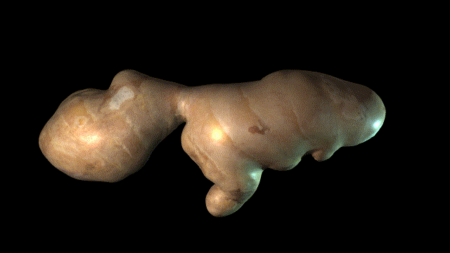

# ClothTOP

This project demonstrates how to use NVIDIA FleX solver for GPU cloth simulation in a TouchDesigner Custom Operator. It also shows how to render dynamic meshes from the texture data using custom vertex/geometry shaders and TouchDesigner's PBR lighting functions.

Features:
- Cloth/inflatable simulation with controllable anchor points.
- Triangle mesh collision.
- Spheres, boxes and planes collisions.
- Radial forcefields.
- Many controlable parameters like wind, gravity, adherence, stiffness, etc.

## Samples
**ClothTOP_dali.toe**: complex triangle mesh collision with multiple cloth bodies.
 
**ClothTOP_inflatable.toe**: inflatable body with dynamic pressure.
 
**ClothTOP_cloak.toe**: cloth body with animated anchor points.
 

## Install NVIDIA FleX

- Download [FleX 1.2](https://github.com/NVIDIAGameWorks/FleX) (get access [here](https://developer.nvidia.com/gameworks-source-github)).
- Create a new environment variable called `NvFlexDir` that holds the path to `/flex` (folder you've unpacked).

## Compilation

- Install the [CUDA SDK](https://developer.nvidia.com/Cuda-downloads) you want to use.  
- Generate the Visual Studio project using [CMake](https://cmake.org/download/).  
- Building will automatically copy the .dll to the Plugins folder. If iusing a release dll, manually place it here.  
- Open a demo with [TouchDesigner](https://derivative.ca/download) 2020.28110+ supported (tested on Windows 10).

## Assets

- [Dali](https://sketchfab.com/3d-models/dalithe-persistence-of-memory-ab3e99facbdb4d9d8661d3f07815638e) 3D model (download and place the .fbx next to ClothTOP_dali.toe)  
- [Cloak](https://www.turbosquid.com/3d-models/free-cloak-cape-robe-3d-model/299477) 3D model (already in ClothTOP_cloak.toe) 

## References

- The FlexCHOP by Vincent Houzé provided a starting point for this project.

## Known Issues
- Moving anchors too fast can cause crashes with the solver not converging for extreme position deltas.
- Lack of robust error checking for input meshes.