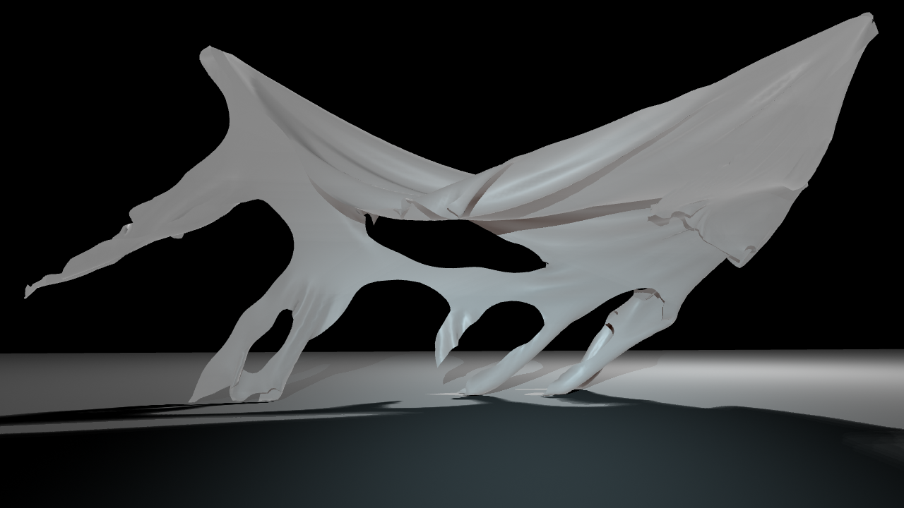

# ClothTOP

This project demonstrates how to use NVIDIA FleX for cloth simulation in a TouchDesigner Custom Operator. 

Features:
- Cloth/inflatable simulation with controllable anchor points.
- Triangle mesh collision.
- Spheres, boxes and planes collisions.
- Many controlable parameters like Wind, Gravity, Adherence and Stiffness!

Demos:
- **ClothTOP_dali.toe** shows complex triangle mesh collision with multiple cloth bodies.
- **ClothTOP_inflatable.toe** show inflatable body with custom PBR material shaders.
- **ClothTOP_cloak.toe** show cloth body with animated anchor points.

## Download NVIDIA FleX

Download [FleX 1.2](https://github.com/NVIDIAGameWorks/FleX) (get access [here](https://developer.nvidia.com/gameworks-source-github)). Then create a new environment variable called `NvFlexDir` that holds the path to `/flex`.

## Compilation

Install the [CUDA SDK](https://developer.nvidia.com/Cuda-downloads) you want to use. Then generate the Visual Studio project using [CMake](https://cmake.org/download/). Building it automatically copies the .dll to a Plugins folder in the **.toe** file's directory. If intead you are using the release, just create the Plugins folder yourself and place the .dll there.  
TouchDesigner 2020.28110+ supported (tested on Windows 10).

## 3D Models

[Dali](https://sketchfab.com/3d-models/dalithe-persistence-of-memory-ab3e99facbdb4d9d8661d3f07815638e) 3D model (download and place fbx in root folder!)  
[Inflatable](https://www.turbosquid.com/3d-models/unity-decor-model-1360123) 3D model  
[Cloak](https://www.turbosquid.com/3d-models/free-cloak-cape-robe-3d-model/299477) 3D model  

## References

- FlexCHOP from Vincent Houzé provided a starting point for this project.

## Demo Previews

## Known Issues
- Moving anchors too fast can cause crashes. The solver may not converge for extreme deltas.
- The **UV** output mode can easily crash for certain meshes. Recommended use of **Linear** mode.